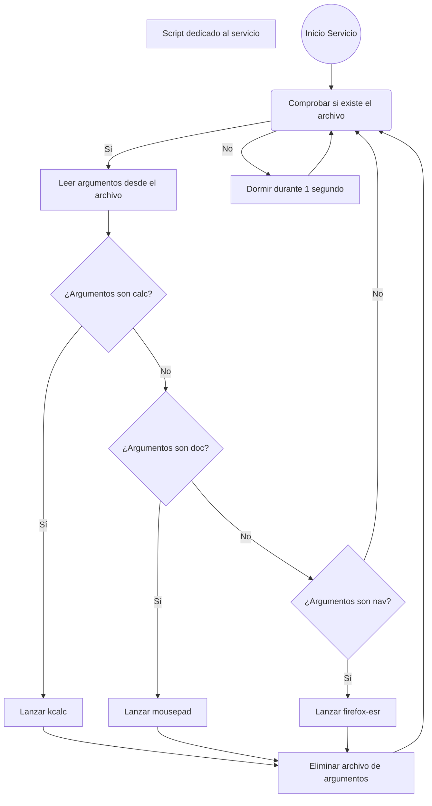

import AsciinemaWidget from '/src/components/AsciinemaWidget';


# Teoría
## Introducción
Un servicio se refiere a un programa o proceso que se ejecuta en segundo plano y proporciona una funcionalidad específica 
al sistema. Estos servicios pueden incluir servidores web, bases de datos, servidores de archivos, servicios de impresión, entre otros.

Una característica clave de los servicios, es que generalmente se inician automáticamente durante 
el arranque del sistema y se ejecutan en segundo plano, sin necesidad de intervención del usuario. Además, 
los servicios en Linux suelen ser administrados a través de herramientas específicas como systemd, init.d, 
Upstart, entre otros, que permiten iniciar, detener, reiniciar y administrar el estado de los servicios de 
manera eficiente.

Los servicios pueden ser:

- **Generales (de sistema):** activos para todos los usuarios, gestionados por root.
- **De usuario:** activos sólo para un usuario concreto, gestionados por el propio usuario.

---


## sysVinit
SysV init es un sistema de inicio tradicional utilizado en sistemas Unix y Linux. Es un proceso de arranque secuencial 
que se encarga de inicializar el sistema y lanzar servicios y procesos esenciales.   
Algunas distribuciones que utilizan este gestor de procesos:
- Arch Linux
- Locos
- Ubuntu hasta v15.04
- etc

## systemd
Los servicios son gestionados principalmente por el sistema de inicio del sistema operativo. Dependiendo de 
la distribución y la versión del sistema operativo, esto puede variar, pero los sistemas modernos generalmente 
utilizan **`systemd`** como su sistema de inicio predeterminado.

**systemd** es un sistema de inicio y administración de servicios ampliamente utilizado en las distribuciones 
Linux modernas. Es responsable de **iniciar, detener, reiniciar y administrar los servicios del sistema**. Además, 
`systemd` gestiona la inicialización del sistema y proporciona una serie de herramientas para el monitoreo 
y la administración de los servicios en ejecución.

Los servicios específicos se configuran utilizando **archivos de unidad de systemd**, que definen cómo systemd debe 
interactuar con ellos. Estos archivos de unidad se pueden encontrar típicamente en:

- **Servicios de sistema:** `/etc/systemd/system/nombre.service`
- **Servicios de usuario:** `~/.config/systemd/user/nombre.service`

Ejemplos de servicios comunes:
- **Sistema:** `ssh.service`, `postgresql.service`, `apache2.service`
- **Usuario:** `nextcloud-desktop.service`, `flameshot.service`, `app_python.service`

Systemd utiliza estos archivos de unidad para iniciar automáticamente los servicios durante el arranque del sistema, 
así como para gestionar su estado durante el funcionamiento normal del sistema.

## Operaciones más relevantes de `systemd`

### Comandos básicos con `systemctl`

#### Para servicios de sistema
```bash
sudo systemctl daemon-reload             # Recarga configuración del sistema
sudo systemctl enable nombre.service     # Habilita servicio al arranque
sudo systemctl start nombre.service      # Inicia servicio manualmente
sudo systemctl status nombre.service     # Consulta su estado
```

#### Para servicios de usuario
```bash
systemctl --user daemon-reload           # Recarga configuración de usuario
systemctl --user enable nombre.service   # Habilita el servicio al inicio de sesión
systemctl --user start nombre.service    # Inicia el servicio del usuario
systemctl --user status nombre.service   # Consulta el estado del servicio
```

🔐 Nota: para que los servicios de usuario se inicien incluso sin sesión gráfica, activa `linger`:
```bash
sudo loginctl enable-linger nombre_usuario
```

`systemctl` es el comando utilizado por `systemd` para la gestión de servicios: iniciar, detener, habilitar, etc...
* **Recargar la configuración de systemd:** Después de crear un archivo de configuración de un nuevo servicio 
(normalmente en el directorio `/etc/systemd/system/`), es necesario recargar la configuración de systemd para que 
reconozca los cambios. Puedes hacer esto ejecutando el siguiente comando:

    ```bash
    systemctl daemon-reload
    ```

* **Habilitar el servicio:** Si deseas que tu servicio se inicie automáticamente durante el arranque del sistema, 
necesitas habilitarlo. Puedes hacerlo utilizando el siguiente comando:
    
    ```bash
    systemctl enable nombre-del-servicio
   ```
    **Nota:** Reemplaza `nombre-del-servicio` con el nombre real de tu servicio.

* **Iniciar el servicio:** Después de crear y configurar el servicio, puedes iniciarlo para que comience a funcionar. 
    Puedes hacerlo ejecutando el siguiente comando:

    ```sh
      systemctl start nombre-del-servicio
    ```
* **Comprobar estado del servicio:** Puedes verificar el estado del servicio para asegurarte de que se esté ejecutando 
correctamente. Puedes hacerlo ejecutando el siguiente comando:

    ```bash
      systemctl status nombre-del-servicio
    ```

## Ejemplo: creando el primer servicio.
En este ejemplo, crearemos un servicio que simplemente imprime un mensaje en el registro del sistema cada cierto tiempo.
### Crear script
1. Primero, creamos un script con las operaciones a realizar. En este caso escribiremos la fecha en un archivo log.
Para ello, creamos nuestro script por ejemplo con nano:
```bash
sudo nano /usr/local/bin/inicio.sh
```
2. Añadimos el código que queremos ejecutar:
```bash
#!/bin/bash
echo "$(date)" >> /var/log/inicio.log
```
3. Cambiar permisos al script. 
Al crear el script, los permisos son los siguientes:   
`-rw-r--r--  1 root root   46 feb 16 10:42 inicio.sh`   
El usuario `root` debe poder ejecutar el script, ya que es el servicio en nombre de ese usuario quien lo lanza.   
Además, para que nos sea más sencillo poder modificar este script, cambiaremos los permisos para que nuestro usuario 
también pueda editar, leer, y ejecutar.
```bash
sudo chown damx:root /usr/local/bin/inicio.sh
sudo chmod 774 /usr/local/bin/inicio.sh
```
Finalmente, los permisos del script `inicio.sh` quedan de la siguiente manera:
`-rwxrwxr--  1 damx root   46 feb 16 10:42 inicio.sh`
### Crear servicio
4. Crea un nuevo archivo de servicio en el directorio `/etc/systemd/system/`. Por ejemplo, puedes nombrar 
el archivo como servicio-inicio.service:
```bash
sudo nano /etc/systemd/system/servicio-inicio.service
```
**Nota:** observa que estamos creando un archivo con **`sudo`**, por lo que el servicio pertenece a **`root`**, no a tu usuario.

5. Dentro del archivo `servicio-inicio.service`, puedes agregar las siguientes líneas para definir el servicio:

```bash
[Unit]
Description=Mi servicio de ejemplo
After=network.target

[Service]
Type=simple
Environment="DISPLAY=:0"
Environment="XAUTHORITY=/home/damx/.Xauthority"
ExecStart=/usr/local/bin/inicio.sh
Restart=on-failure

[Install]
WantedBy=multi-user.target
```

:::danger ⚠️IMPORTANTE
- No poner anotaciones en este archivo del tipo: `# Esta parte sirve para...`
- Sustituir `/home/damx` por la ruta real del directorio de tu usuario.
- En servicios de **sistema**, nunca usar `$HOME` o `$USER`, ya que apuntan a `root`. Usar siempre rutas absolutas completas.
- Este servicio es de sistema pero está configurado para interactuar con la sesión gráfica del usuario. Solo funcionará si existe una sesión gráfica activa.
:::

En este archivo de servicio:

- **Description:** Descripción informativa del servicio.
- **After:** Indica que el servicio se inicia después de que la red esté disponible.
- **Type:** Define el tipo de servicio. `simple` significa que systemd considera activo el servicio en cuanto se ejecuta el proceso principal.
- **Environment="DISPLAY" y "XAUTHORITY":** Variables necesarias para que un servicio de sistema pueda interactuar con la interfaz gráfica del usuario. Sin una sesión gráfica activa, estas variables no tendrán efecto.
- **ExecStart:** Comando que se ejecuta al iniciar el servicio. En este ejemplo, llama a un script que escribe la fecha en `/var/log/inicio.log`.
- **Restart:** Reinicia automáticamente el servicio si falla.
- **WantedBy:** Indica que el servicio se lanzará en el arranque normal del sistema (`multi-user.target`).

6. Después de guardar el archivo, recarga la configuración de systemd:

```bash
sudo systemctl daemon-reload
```

7. Habilita e inicia el servicio:

```bash
sudo systemctl enable servicio-inicio
sudo systemctl start servicio-inicio
```

8. Verifica su estado:

```bash
sudo systemctl status servicio-inicio
```


## Ejemplos

### Ejemplo 1: Servicio Python usando venv

```
[Unit]
Description=Servicio Python con entorno virtual
After=network.target

[Service]
Type=simple
User=damx
WorkingDirectory=/ruta/proyecto
ExecStart=/ruta/proyecto/venv/bin/python script.py
Restart=on-failure

[Install]
WantedBy=multi-user.target
```

---

### Ejemplo 2: Servicio Bash

```
[Unit]
Description=Servicio Bash
After=network.target

[Service]
Type=simple
User=damx
WorkingDirectory=/ruta/proyecto
ExecStart=/ruta/proyecto/inicio.sh
Restart=on-failure

[Install]
WantedBy=multi-user.target
```

Ejemplo de contenido de `inicio.sh`:

```
#!/bin/bash
echo "Servicio activo" >> /var/log/servicio.log
```

---

### Explicación

#### Python con entorno virtual

El binario `venv/bin/python` ya contiene el entorno virtual activado.  
No es necesario usar `source activate`.  
systemd ejecuta directamente ese intérprete.

Ventajas:

- menos capas intermedias
- mejor control del proceso
- logs más claros
- reinicio fiable

---

#### Servicio Bash

systemd ejecuta directamente el script Bash indicado en `ExecStart`.

Este enfoque es útil para:

- automatizaciones
- scripts de mantenimiento
- tareas periódicas
- procesamiento de archivos
- colas de eventos

El script debe tener permisos de ejecución y usar rutas absolutas.

---

#### Variables de entorno opcionales

Añadir dentro de `[Service]`:

```
Environment=VARIABLE=valor
```

o usar archivo externo:

```
EnvironmentFile=/ruta/proyecto/.env
```

---

### Activación del servicio

Guardar como:

```
/etc/systemd/system/miservicio.service
```

Ejecutar:

```
sudo systemctl daemon-reload
sudo systemctl enable miservicio
sudo systemctl start miservicio
```

Estado:

```
systemctl status miservicio
```

Logs:

```
journalctl -u miservicio
```


## Parámetros de entrada
Los servicios son una herramienta fundamental en la gestión eficiente de tareas y procesos en sistemas informáticos. 
Una de las ventajas clave de los servicios radica en su capacidad para recibir parámetros, lo que les permite adaptarse 
dinámicamente a diferentes escenarios y requisitos.   

Una forma simple pero efectiva de implementar esta funcionalidad, es mediante el uso de colas de eventos, 
que pueden ser representadas fácilmente utilizando, por ejemplo, archivos de texto.   
Estas colas permiten que los servicios reciban datos de entrada, como solicitudes de usuario o mensajes del sistema,
y actúen en consecuencia, ejecutando acciones específicas o desencadenando procesos adicionales.   

De esta manera, los servicios pueden funcionar de manera autónoma, procesando tareas en función de los parámetros recibidos, 
lo que optimiza la eficiencia y la capacidad de respuesta del sistema en su conjunto.

## Ejemplo básico cola de eventos
Para realizar este ejemplo vamos a modificar el archivo `inicio.sh` correspondiente al servicio de ejemplo creado en **Servicios 1**.
De tal manera que finalmente el archivo quedará:

```bash title="/usr/local/bin/inicio.sh"
#!/bin/bash

echo "$(date)" >> /var/log/inicio.log

while [[ true ]]; do
    # Comprueba si existe el archivo (hay eventos en cola)
    if [[ -f /tmp/argumentos.txt ]]; then
        arguments=($(cat /tmp/argumentos.txt))
        zenity --info --text="$arguments" --display=:0.0
        # Eliminar el archivo después de usarlo
        rm /tmp/argumentos.txt
    fi

    sleep 5
done
```
- El servicio registra la hora inicio del mismo en el archivo `/var/log/inicio.log`.
- Inicia un bucle que cada 5 segundos (`sleep 5`), comprueba si existe el archivo `/tmp/argumentos.txt`.
- En caso de que el archivo exista (existe un evento), almacena su contenido en la variable `arguments`, y muestra el contenido en un cuadro de diálogo.
- Por último, elimina el archivo (borrar la cola de eventos).
:::note Nota
La cola de eventos únicamente puede manejar una solicitud cada 5 segundos. En caso de querer manejar más solicitudes, es necesario
modificar el script para realizar un bucle for sobre el archivo.
:::
:::info Ejercicio propuesto UT4_7
Completa el ejemplo creando un script que capture un evento por cuadro de diálogo de entrada. Añade el texto capturado en
el archivo `/tmp/argumentos.txt`.
Ejecuta acciones concretas **en el servicio** dependiendo de la palabra recibida. Por ejemplo:
- Si la palabra clave es **doc** abrir un editor de texto.
- Si la palabra clave es **calc** abrir una calculadora.
- Si la palabra clave es **nav** abrir un navegador.
- Etc...   

**Nota:** Reduce el tiempo de comprobación de la cola de eventos para que la gestión sea más rápida.
:::

